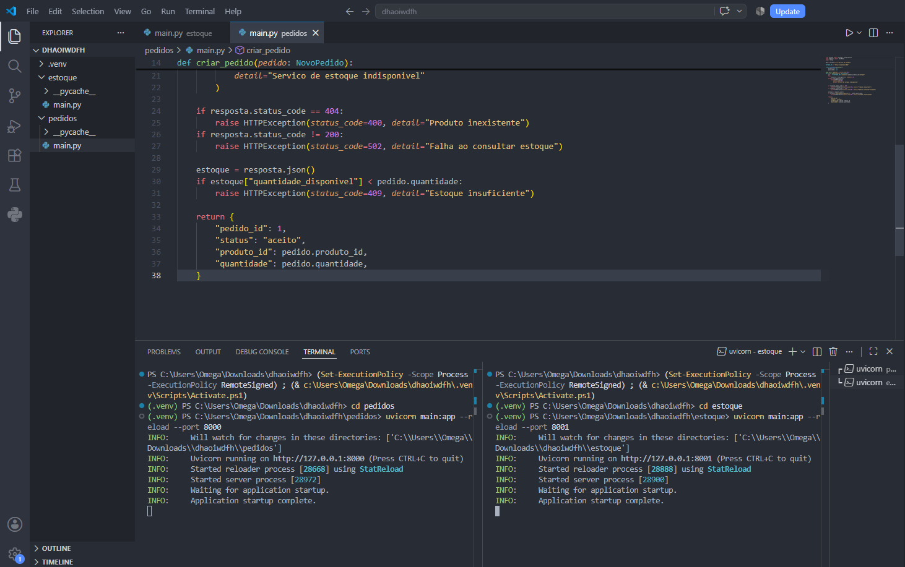
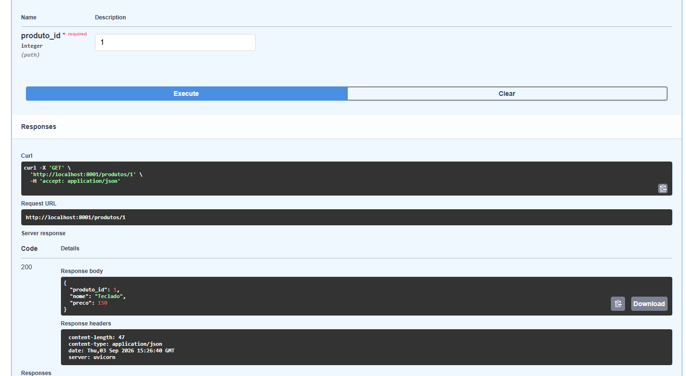
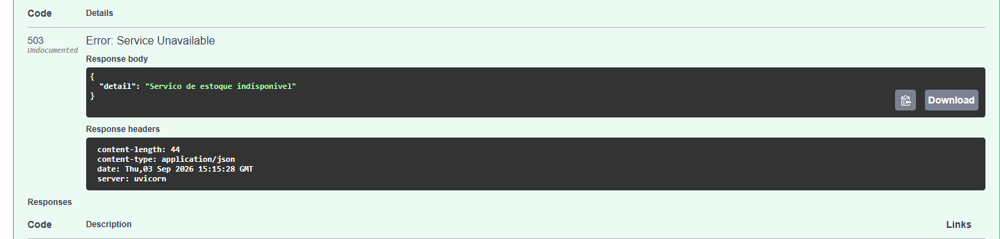
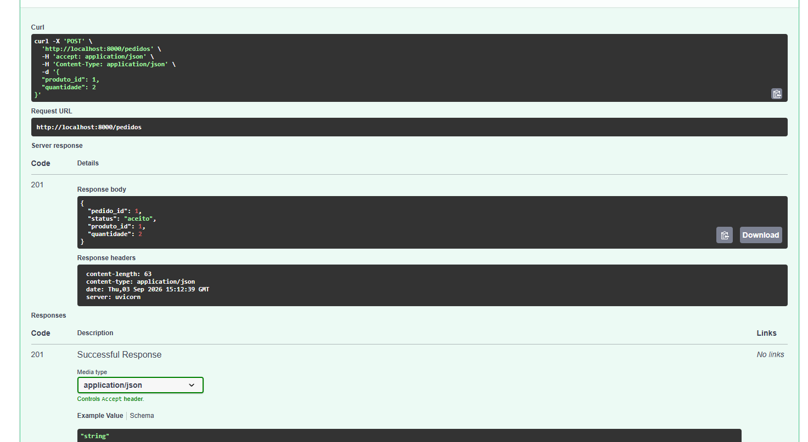
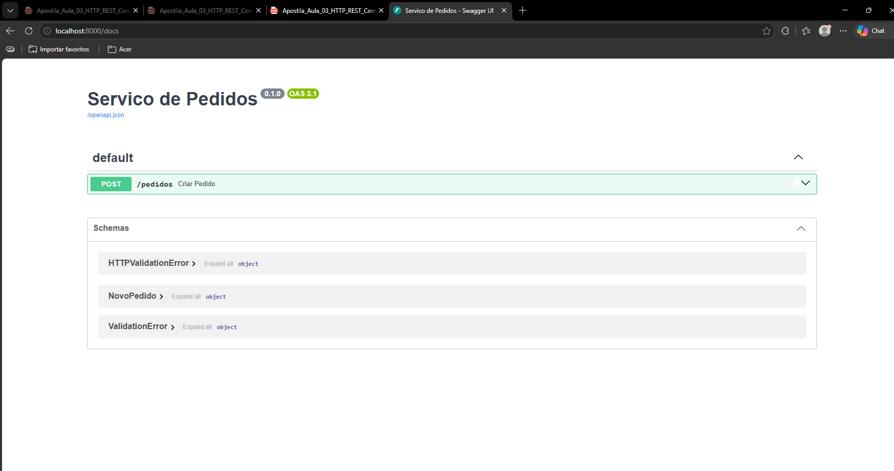

````
# Mini-Lab: Sistemas Distribuídos (HTTP & REST)

Um ambiente prático de microsserviços demonstrando a comunicação síncrona entre aplicações utilizando **FastAPI** e **HTTP/REST**. Este projeto ilustra conceitos fundamentais de sistemas distribuídos, como tolerância a falhas parciais, acoplamento temporal e o padrão *stateless*.

## Arquitetura do Projeto

O sistema é composto por dois serviços independentes que executam em portas distintas e se comunicam via rede:

*   **Serviço de Estoque (Porta 8001):** Gerencia o catálogo, os preços e a disponibilidade dos produtos.
*   **Serviço de Pedidos (Porta 8000):** Recebe requisições de novos pedidos e consulta o Estoque de forma síncrona para validar a disponibilidade antes de confirmar a operação.

## Funcionalidades Implementadas

*   **Comunicação Síncrona:** O Serviço de Pedidos consome a API de Estoque utilizando a biblioteca `httpx`.
*   **Tratamento de Falhas e Timeouts:** Simulação de indisponibilidade (Erro 503), garantindo que o cliente receba respostas estruturadas quando uma dependência remota falha ou excede o tempo limite de espera (3 segundos).
*   **Rastreabilidade Distribuída:** Implementação de `x-correlation-id` via cabeçalhos (headers) para acompanhar o fluxo das requisições entre os serviços.
*   **Validação e Estado:** Uso do Pydantic para validação estrita de dados de entrada (ex: bloquear quantidades zeradas) e persistência em memória para buscar os pedidos criados.

## Como Executar

**1. Clone o repositório e crie o ambiente virtual:**
```bash
git clone [https://github.com/OmegaCampione/MiniLabDistributedSystems1.git](https://github.com/OmegaCampione/MiniLabDistributedSystems1.git)
cd MiniLabDistributedSystems1
python -m venv .venv

````

**2. Ative o ambiente virtual e instale as dependências:**

```bash
# Usuários de Windows (PowerShell)
.venv\Scripts\Activate.ps1

# Usuários de Linux/macOS
source .venv/bin/activate

pip install fastapi uvicorn httpx

```

**3. Inicie os serviços (em terminais separados):**

```bash
# Terminal 1: Iniciar o Serviço de Estoque
cd estoque
uvicorn main:app --reload --port 8001

# Terminal 2: Iniciar o Serviço de Pedidos
cd pedidos
uvicorn main:app --reload --port 8000

```

## 📸 Demonstração

Abaixo estão as capturas de tela demonstrando o funcionamento interativo das APIs via Swagger UI e a integração entre os serviços:





